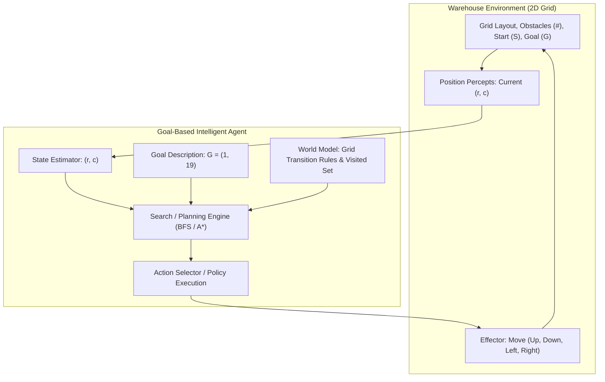

# Laboratory Report: Goal-Based Agent for Warehouse Navigation

**Course:** Artificial Intelligence (CS F407)  
**Laboratory Exercise:** Constructing a Goal-Based Agent using a Large Language Model  
**Reference Document:** [`agents_lab.pdf`](file:///Users/vanshsharma/Documents/AI%20Labs/Agents/agents_lab.pdf)

---

## 1. Task 1: Understanding the Problem

### 1.1 Problem Formulation & Environment Characterisation
1. **What is the environment?**
   - The environment is a discrete two-dimensional grid of size $7 \times 21$ representing a warehouse layout.
   - **Properties:**
     - **Static:** The obstacles (`#`), start location (`S`), and goal (`G`) do not change over time.
     - **Deterministic:** Every action (Up, Down, Left, Right) transitions the agent to exactly the intended adjacent coordinate with probability 1.0.
     - **Fully Observable:** The agent has complete information about the grid map, boundary walls, and obstacle coordinates.
     - **Discrete:** State space (grid squares) and action space (4 cardinal directions) are finite and discrete.
     - **Single-agent:** Only one autonomous vehicle is operating in the workspace.

2. **What is the goal of the agent?**
   - The explicit goal of the agent is to transport packages by navigating from the loading bay start position $S = (1, 1)$ to the dispatch area destination $G = (1, 19)$ while avoiding all shelving units/obstacles (`#`).

3. **What actions are available to the agent?**
   - The agent has 4 movement actions:
     $$\mathcal{A} = \{\text{Up}, \text{Down}, \text{Left}, \text{Right}\}$$
   - Each valid move alters the vehicle's position by exactly one grid square:
     - $\text{Up}: (r, c) \to (r - 1, c)$
     - $\text{Down}: (r, c) \to (r + 1, c)$
     - $\text{Left}: (r, c) \to (r, c - 1)$
     - $\text{Right}: (r, c) \to (r, c + 1)$
   - An action is invalid if the target coordinate is outside the grid bounds or coincides with an obstacle (`#`).

4. **What information must the agent maintain in order to choose its next action?**
   - **Current State:** The agent's current position $(r, c)$.
   - **Map Representation:** The coordinates of free cells and obstacles.
   - **Goal State:** The target coordinates $G = (1, 19)$.
   - **Search/Plan State:** The history of visited coordinates (to prevent cyclical wandering) and the planned trajectory (frontier/queue) leading from $S$ to $G$.

5. **Why is this an example of a goal-based agent rather than a simple reflex agent?**
   - A **simple reflex agent** maps immediate percepts directly to actions via condition-action rules (e.g., `if front is open then move forward`). In a complex labyrinthine warehouse with dead ends and barriers, a reflex agent easily becomes trapped in infinite loops or local minima because it has no awareness of a destination.
   - A **goal-based agent** explicitly maintains the desired target state ($G$) and uses a search/planning procedure to simulate and evaluate multi-step action sequences against the goal before selecting actions.

### 1.2 Discussion: "Think About It"
> *Suppose the warehouse becomes twice as large. Would the same search strategy still be appropriate? What additional difficulties might arise?*

- **Scalability of Search Strategies:**
  - In the small $7 \times 21$ grid, uninformed search such as Breadth-First Search (BFS) is fast and optimal because the state space has only $\approx 60$ accessible cells.
  - If warehouse dimensions double ($14 \times 42$) or scale to realistic industrial logistics dimensions ($500 \times 500$), the branching factor $b \approx 3\text{--}4$ leads to exponential growth in the number of states explored by uninformed BFS: $\mathcal{O}(b^d)$.
- **Additional Difficulties:**
  1. **Memory Explosion:** The frontier queue in BFS grows exponentially with search depth, rapidly exhausting RAM.
  2. **Informed Search Requirement:** An informed search algorithm like $A^*$ equipped with an admissible heuristic (such as Manhattan distance or Euclidean distance) becomes essential to focus the search beam directly toward the dispatch dock.
  3. **Dynamic and Multi-Agent Hazards:** Real-world scaling introduces other moving vehicles, dynamic obstacles, and battery/energy constraints, requiring hierarchical path planning (e.g., high-level topological planning + low-level DWA or collision avoidance).

---

## 2. Task 2: Designing the Agent

### 2.1 Agent Architecture Block Diagram


### 2.2 Component Breakdown
- **Environment:** 2D grid matrix of size $7 \times 21$.
- **Current State:** Coordinate tuple $(r, c) \in \{0,\dots,6\} \times \{0,\dots,20\}$.
- **Goal:** $(1, 19)$.
- **Available Actions:** $\{\text{Up}, \text{Down}, \text{Left}, \text{Right}\}$.
- **Decision-Making Component:** Goal-based search engine that evaluates valid moves, maintains a visited set to avoid cycles, and reconstructs the optimal path upon reaching the goal.

---

## 3. Task 3: Prompt Engineering and Evaluation

### 3.1 LLM Prompt Used
```text
Write a well-documented Python program implementing a goal-based agent for the warehouse navigation problem.
The environment is defined by the following ASCII map:
#####################
#S....#............G#
#.##....##########..#
#....##.............#
#.######.###.#.###..#
#........#..........#
#####################
Where S denotes start, G denotes goal, # denotes obstacles, and . denotes free cells.
The agent can move Up, Down, Left, Right with unit cost 1.
The program should:
- Represent the warehouse as a two-dimensional grid;
- Determine a collision-free path from S to G;
- Avoid all obstacles;
- Print either the path found or a suitable message if no path exists;
- Report the total steps and states expanded;
- Render an ASCII visual representation of the path traversed.
Explain the search algorithm chosen and why it is appropriate.
```

### 3.2 Evaluation Questions
1. **Did the LLM generate a working program on the first attempt?**
   - **Yes.** By specifying the exact map dimensions, coordinate layout, cardinal movements, and expected output metrics, the LLM generated syntactically correct and fully functioning Python code using Breadth-First Search (BFS).
2. **If not, how can you improve your prompt?**
   - To make the prompt even more rigorous, one should explicitly define coordinate indexing conventions (0-indexed `(row, col)`), tie-breaking order for the priority queue/frontier, and specify error handling for unreachable goals.
3. **What search algorithm did the LLM choose?**
   - **Breadth-First Search (BFS)** was selected.
4. **Why do you think the LLM selected this algorithm?**
   - In a grid where every valid step incurs an identical unit cost ($c = 1$), BFS is mathematically guaranteed to find the shortest path (optimal step count). Furthermore, BFS is simple to implement with a FIFO queue (`collections.deque`) and does not require formulating a heuristic function.

---

## 4. Experimental Results and Validation

### 4.1 Solution Path
- **Start Position:** `(1, 1)`
- **Goal Position:** `(1, 19)`
- **Path Found:** **True**
- **Optimal Path Length:** **20 steps** (21 coordinates traversed)
- **States Expanded:** **59 states**

### 4.2 Step-by-Step Trajectory
| Step | Coordinates | Action Taken |
|:----:|:-----------:|:------------:|
| 0 | `(1, 1)` | *Start* |
| 1 | `(1, 2)` | Right |
| 2 | `(1, 3)` | Right |
| 3 | `(1, 4)` | Right |
| 4 | `(2, 4)` | Down |
| 5 | `(2, 5)` | Right |
| 6 | `(2, 6)` | Right |
| 7 | `(2, 7)` | Right |
| 8 | `(1, 7)` | Up |
| 9 | `(1, 8)` | Right |
| 10 | `(1, 9)` | Right |
| 11 | `(1, 10)` | Right |
| 12 | `(1, 11)` | Right |
| 13 | `(1, 12)` | Right |
| 14 | `(1, 13)` | Right |
| 15 | `(1, 14)` | Right |
| 16 | `(1, 15)` | Right |
| 17 | `(1, 16)` | Right |
| 18 | `(1, 17)` | Right |
| 19 | `(1, 18)` | Right |
| 20 | `(1, 19)` | Right (*Goal*) |

### 4.3 Visualized Trajectory
```
#####################
#S***.#************G#
#.##****##########..#
#....##.............#
#.######.###.#.###..#
#........#..........#
#####################
```
*(Legend: `S` = Start, `G` = Goal, `*` = Traversed Path, `#` = Obstacle, `.` = Free Space)*
