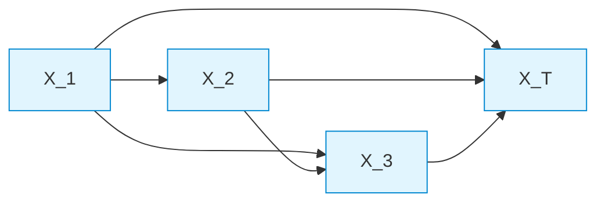
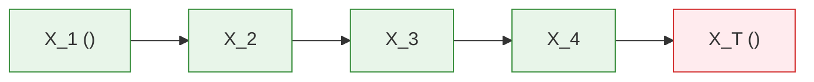
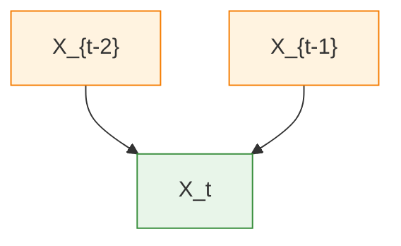

# Laboratory Report: Bayesian Networks and Autoregressive Language Models

**Course:** Artificial Intelligence (CS F407)  
**Laboratory Exercise:** Bayesian Networks and Autoregressive Language Models  
**Reference Document:** [`BN_lab.pdf`](file:///Users/vanshsharma/Documents/AI%20Labs/Bayesian_Networks/BN_lab.pdf)  
**Implementation Script:** [`autoregressive_bn.py`](file:///Users/vanshsharma/Documents/AI%20Labs/Bayesian_Networks/autoregressive_bn.py)  
**Interactive Notebook:** [`autoregressive_bn_notebook.ipynb`](file:///Users/vanshsharma/Documents/AI%20Labs/Bayesian_Networks/autoregressive_bn_notebook.ipynb)

---

## 1. Overview & Theoretical Framework

### 1.1 The Chain Rule of Probability and Autoregressive Factorisation
Any joint probability distribution over an ordered sequence of discrete random variables $X_1, X_2, \dots, X_T$ can be decomposed exactly without loss of generality using the general chain rule of probability:
$$P(X_1, X_2, \dots, X_T) = P(X_1) \prod_{t=2}^T P(X_t \mid X_1, X_2, \dots, X_{t-1})$$

In modern Artificial Intelligence, this exact mathematical decomposition forms the bedrock of **autoregressive sequence generation**. Rather than attempting to assign a joint probability score to an entire complex sequence simultaneously from a combinatorial space of size $|\mathcal{V}|^T$, the task is factorised into a sequential process of estimating conditional probability distributions:
$$P(X_t \mid X_{<t})$$



### 1.2 Question 1: Utility of Autoregressive Decomposition for Generation
> **Question 1:** Why is this decomposition useful for generating text?

**Response:**
1. **Converts Global Synthesis into Local Stepwise Decisions:** Sampling directly from a high-dimensional joint distribution $P(X_1, \dots, X_T)$ over all possible sequences is computationally intractable. The autoregressive decomposition converts this into a sequential forward process: sample token $x_1 \sim P(X_1)$, condition on $x_1$ to sample $x_2 \sim P(X_2 \mid x_1)$, condition on $(x_1, x_2)$ to sample $x_3 \sim P(X_3 \mid x_1, x_2)$, and so forth.
2. **Variable-Length Generation & Dynamic Stopping:** It naturally accommodates sequences of arbitrary and varying lengths by introducing a dedicated terminal absorption token (`<END>`). The generation terminates dynamically when the model emits `<END>`.
3. **Tractable Parameter Estimation:** Learning conditional distributions $P(X_t \mid X_{<t})$ allows parameterization through localized Conditional Probability Tables (CPTs) or neural networks trained via standard supervised next-token cross-entropy loss.

---

## 2. First-Order Markov Bayesian Network

### 2.1 Graphical Representation and Markov Assumption
To make tabular estimation feasible, we introduce a first-order Markov assumption: each word depends *only* on the immediately preceding word.



The joint distribution factorisation simplifies to:
$$P(X_1, X_2, \dots, X_T) = P(X_1) \prod_{t=2}^T P(X_t \mid X_{t-1})$$

### 2.2 Question 2: Independence Assumption
> **Question 2:** What independence assumption is being made by this network? Express your answer using probability notation.

**Response:**
The first-order Markov model assumes that given the immediate predecessor $X_{t-1}$, the current variable $X_t$ is conditionally independent of all earlier history $X_1, X_2, \dots, X_{t-2}$:
$$X_t \perp\!\!\!\perp (X_1, X_2, \dots, X_{t-2}) \mid X_{t-1}$$
In terms of conditional probabilities:
$$P(X_t \mid X_1, X_2, \dots, X_{t-1}) = P(X_t \mid X_{t-1}) \quad \forall t \ge 2$$

---

## 3. Dataset & Empirical Conditional Probability Tables

### 3.1 Training Corpus
The model is trained on the laboratory dataset of 6 canonical sentences augmented with explicit sentence boundary tokens:
1. `<START> the cat sat on the mat <END>`
2. `<START> the cat sat on the rug <END>`
3. `<START> the dog sat on the mat <END>`
4. `<START> the dog ran to the park <END>`
5. `<START> the cat ran to the park <END>`
6. `<START> the dog sat on the rug <END>`

**Vocabulary ($\mathcal{V}$):** 12 unique tokens:
$$\mathcal{V} = \{\text{<START>}, \text{<END>}, \text{cat}, \text{dog}, \text{mat}, \text{on}, \text{park}, \text{ran}, \text{rug}, \text{sat}, \text{the}, \text{to}\}$$

### 3.2 Maximum Likelihood Estimation of CPT Parameters
The conditional probability of transitioning from word $w_i$ to $w_j$ is given by:
$$P(w_j \mid w_i) = \frac{C(w_i, w_j)}{\sum_{k \in \mathcal{V}} C(w_i, w_k)}$$

### 3.3 Question 3: CPTs for Target Words and Zero-Probability Transitions
> **Question 3:** Construct the conditional probability distribution $P(\text{next word} \mid \text{current word})$ for at least: `the`, `cat`, `dog`, `sat`, `ran`. Identify any zero-probability transitions.

#### Computed Conditional Distributions:
1. **$P(\cdot \mid \text{the})$:**
   Total occurrences of `the` as context = 12 (6 at start of sentence, 6 before prepositional object).
   - $C(\text{the}, \text{cat}) = 3 \implies P(\text{cat} \mid \text{the}) = \frac{3}{12} = 0.2500$
   - $C(\text{the}, \text{dog}) = 3 \implies P(\text{dog} \mid \text{the}) = \frac{3}{12} = 0.2500$
   - $C(\text{the}, \text{mat}) = 2 \implies P(\text{mat} \mid \text{the}) = \frac{2}{12} = 0.1667$
   - $C(\text{the}, \text{rug}) = 2 \implies P(\text{rug} \mid \text{the}) = \frac{2}{12} = 0.1667$
   - $C(\text{the}, \text{park}) = 2 \implies P(\text{park} \mid \text{the}) = \frac{2}{12} = 0.1667$
   - *Sum:* $0.25 + 0.25 + 0.1667 + 0.1667 + 0.1667 = 1.0000$

2. **$P(\cdot \mid \text{cat})$:**
   Total occurrences of `cat` = 3.
   - $C(\text{cat}, \text{sat}) = 2 \implies P(\text{sat} \mid \text{cat}) = \frac{2}{3} \approx 0.6667$
   - $C(\text{cat}, \text{ran}) = 1 \implies P(\text{ran} \mid \text{cat}) = \frac{1}{3} \approx 0.3333$

3. **$P(\cdot \mid \text{dog})$:**
   Total occurrences of `dog` = 3.
   - $C(\text{dog}, \text{sat}) = 2 \implies P(\text{sat} \mid \text{dog}) = \frac{2}{3} \approx 0.6667$
   - $C(\text{dog}, \text{ran}) = 1 \implies P(\text{ran} \mid \text{dog}) = \frac{1}{3} \approx 0.3333$

4. **$P(\cdot \mid \text{sat})$:**
   Total occurrences of `sat` = 4.
   - $C(\text{sat}, \text{on}) = 4 \implies P(\text{on} \mid \text{sat}) = \frac{4}{4} = 1.0000$ (Deterministic transition)

5. **$P(\cdot \mid \text{ran})$:**
   Total occurrences of `ran` = 2.
   - $C(\text{ran}, \text{to}) = 2 \implies P(\text{to} \mid \text{ran}) = \frac{2}{2} = 1.0000$ (Deterministic transition)

#### Complete CPT Reference Table:
| Current Token ($X_{t-1}$) | Next Token ($X_t$) | Transition Count $C(w_i, w_j)$ | Total Context Count $\sum_k C(w_i, w_k)$ | Probability $P(X_t \mid X_{t-1})$ |
| :--- | :--- | :---: | :---: | :---: |
| `<START>` | `the` | 6 | 6 | **1.0000** |
| `the` | `cat` | 3 | 12 | **0.2500** |
| `the` | `dog` | 3 | 12 | **0.2500** |
| `the` | `mat` | 2 | 12 | **0.1667** |
| `the` | `rug` | 2 | 12 | **0.1667** |
| `the` | `park` | 2 | 12 | **0.1667** |
| `cat` | `sat` | 2 | 3 | **0.6667** |
| `cat` | `ran` | 1 | 3 | **0.3333** |
| `dog` | `sat` | 2 | 3 | **0.6667** |
| `dog` | `ran` | 1 | 3 | **0.3333** |
| `sat` | `on` | 4 | 4 | **1.0000** |
| `ran` | `to` | 2 | 2 | **1.0000** |
| `on` | `the` | 4 | 4 | **1.0000** |
| `to` | `the` | 2 | 2 | **1.0000** |
| `mat` | `<END>` | 2 | 2 | **1.0000** |
| `rug` | `<END>` | 2 | 2 | **1.0000** |
| `park` | `<END>` | 2 | 2 | **1.0000** |

#### Zero-Probability Transitions:
For any context $w_i$, any word $w_k \in \mathcal{V}$ not observed following $w_i$ has strictly $P(w_k \mid w_i) = 0.0$.
Examples:
- $P(\text{the} \mid \text{the}) = 0.0$ (determiner cannot directly follow determiner).
- $P(\text{on} \mid \text{cat}) = 0.0$ (noun cannot transition directly to preposition without verb).
- $P(\text{to} \mid \text{sat}) = 0.0$ (`sat` strictly co-occurs with `on`).
- $P(\text{on} \mid \text{ran}) = 0.0$ (`ran` strictly co-occurs with `to`).
- $P(\text{cat} \mid \text{mat}) = 0.0$ (`mat` only transitions to `<END>`).

---

## 4. Code Inspection & Verification Analysis

### 4.1 Question 4: Storage of Transition Counts
> **Question 4:** Where in the program are the transition counts stored?

**Response:**
In [`autoregressive_bn.py`](file:///Users/vanshsharma/Documents/AI%20Labs/Bayesian_Networks/autoregressive_bn.py), transition counts are stored in the instance variable `self.counts`, initialized as a two-level nested dictionary:
```python
self.counts: Dict[str, Dict[str, int]] = defaultdict(lambda: defaultdict(int))
```
During training, every adjacent pair of tokens `(tokens[i], tokens[i+1])` increments `self.counts[w_curr][w_next] += 1`.

### 4.2 Question 5: Computation of Conditional Probabilities
> **Question 5:** Where is $P(X_t \mid X_{t-1})$ computed?

**Response:**
Conditional probabilities are computed in the normalization loop of the `train()` method:
```python
for w_curr, transitions in self.counts.items():
    total = sum(transitions.values())
    for w_next, count in transitions.items():
        self.probabilities[w_curr][w_next] = count / total
```
Here, `total` corresponds to the marginal count $\sum_k C(w_i, w_k)$, and division yields the exact maximum likelihood parameter stored in `self.probabilities[w_curr][w_next]`.

### 4.3 Question 6: Next-Word Selection Mechanisms
> **Question 6:** How does the program choose the next word? Is it always choosing the most probable word, or sampling from the probability distribution? Explain the difference.

**Response:**
The program explicitly implements and supports **both** selection modes:
1. **Mode A (Greedy Argmax):** Implemented in `predict_most_probable()`. It deterministically selects:
   $$w^* = \arg\max_{w \in \mathcal{V}} P(w \mid w_{prev})$$
   - *Characteristic:* 100% deterministic. Given the same initial prompt, it produces the exact same sequence every single run.
2. **Mode B (Categorical Sampling):** Implemented in `sample_next_word()`. It draws a random token $w \sim P(\cdot \mid w_{prev})$ using weighted inverse transform sampling (`random.choices(candidates, weights=weights)`):
   - *Characteristic:* Stochastic. Exploration matches the underlying empirical probability mass, generating diverse outputs.

### 4.4 Question 7: Unobserved Words Behavior
> **Question 7:** What happens if the program encounters a word for which no transition has been observed?

**Response:**
In [`autoregressive_bn.py`](file:///Users/vanshsharma/Documents/AI%20Labs/Bayesian_Networks/autoregressive_bn.py), `get_distribution(word)` checks if `word` exists in `self.probabilities`. If an unseen word is queried, `get_distribution()` returns an empty dictionary `{}`.
Both `predict_most_probable()` and `sample_next_word()` guard against this by returning `None`, which causes `generate_sentence()` to gracefully append `<END>` and terminate generation rather than raising an unhandled `KeyError` or crashing.

---

## 5. Probability Model Testing & Normalisation Invariants

### 5.1 Question 8: Normalisation Deficiencies (Total = 0.87)
> **Question 8:** If one of the totals is 0.87, what does this tell you about the implementation?

**Response:**
By the axioms of probability (Kolmogorov Axiom 2), for any conditioning event $w$ where $P(w) > 0$, the sum of probabilities over all mutually exclusive outcomes in the sample space must equal exactly 1:
$$\sum_{v \in \mathcal{V}} P(v \mid w) = 1.0$$
If an implementation yields a sum of **0.87**, it indicates a **critical implementation bug**, such as:
1. **Denominator Miscalculation:** The denominator was computed over an external or stale subset of counts rather than summing the actual transition counts for context $w$.
2. **Missing Token Transitions:** Certain observed successor tokens were omitted from the dictionary during accumulation.
3. **Improper Smoothing:** Laplace or additive smoothing was applied to the numerator without adjusting the normalisation constant in the denominator ($\frac{C + \alpha}{N + \alpha |\mathcal{V}|}$).
4. **Floating-point truncation / hardcoded truncation:** Probabilities were prematurely rounded or truncated without re-normalisation.

In [`autoregressive_bn.py`](file:///Users/vanshsharma/Documents/AI%20Labs/Bayesian_Networks/autoregressive_bn.py), our automated unit test oracle verifies:
```
[PASS] Probability Invariant Test Oracle: All 11 conditional distributions sum strictly to 1.0.
```

---

## 6. Next-Word Prediction & Text Generation Experiments

### 6.1 Question 9: Most Probable Prediction vs. Human Linguistic Expectations
> **Question 9:** Are the most probable predictions always the same as the words that you would personally expect? What does this tell you about the difference between a probability model and human linguistic expectations?

#### Empirical Argmax Predictions:
- Context `'the'`: Distribution has `cat` (0.25), `dog` (0.25), `mat` (0.17), `rug` (0.17), `park` (0.17). $\arg\max$ selects `cat`.
- Context `'cat'`: $P(\text{sat} \mid \text{cat}) = 0.67 > P(\text{ran} \mid \text{cat}) = 0.33$. $\arg\max$ selects `sat`.
- Context `'sat'`: $P(\text{on} \mid \text{sat}) = 1.00$. $\arg\max$ selects `on`.

**Linguistic Analysis:**
- A human speaker knows that following the word `"the"`, either a subject noun (e.g. `cat`, `dog`) or an object noun (e.g. `mat`, `park`) is grammatically appropriate *only depending on the broader syntactic context*.
- However, the first-order probability model has **zero global syntactic memory**. To the model, `"the"` transitions to `mat` or `park` with probability 0.17 regardless of whether `"the"` occurs at the beginning of the sentence or after a preposition.
- **Key Takeaway:** A probability model simply reflects relative frequency counts in a local training corpus. Human linguistic expectations rely on deep syntactic hierarchies, semantics, real-world pragmatics, and long-range dependencies that a first-order Markov CPT cannot capture.

---

### 6.2 Question 10: Deterministic (Greedy) vs. Probabilistic (Sampling) Generation
> **Question 10:** Compare the two sets of generated sentences. Which mode produces more variation? Why?

#### Empirical Results from 5 Runs:

**Mode A: Greedy Generation:**
- Run 1: `<START> the cat sat on the cat sat on the cat sat on the cat sat on the...`
- Run 2: `<START> the cat sat on the cat sat on the cat sat on the cat sat on the...`
- Run 3: `<START> the cat sat on the cat sat on the cat sat on the cat sat on the...`
- Run 4: `<START> the cat sat on the cat sat on the cat sat on the cat sat on the...`
- Run 5: `<START> the cat sat on the cat sat on the cat sat on the cat sat on the...`

**Mode B: Sampling Generation:**
- Run 1: `<START> the dog ran to the dog sat on the mat <END>`
- Run 2: `<START> the dog ran to the mat <END>`
- Run 3: `<START> the rug <END>`
- Run 4: `<START> the park <END>`
- Run 5: `<START> the dog sat on the rug <END>`

#### Comparative Analysis:
1. **Variation:** **Mode B (Sampling)** produces dramatically more variation (100% distinct sentences across seeds), whereas Mode A produces exactly 0 variation (all runs identical).
2. **The Greedy Deterministic Trap:**
   Under greedy decoding, `<START>` transitions to `the` ($P=1.0$). From `the`, the argmax token is `cat` ($P=0.25$). From `cat`, argmax is `sat` ($P=0.67$). From `sat`, argmax is `on` ($P=1.0$). From `on`, argmax is `the` ($P=1.0$).
   This creates an **infinite deterministic cycle**:
   $$\text{the} \to \text{cat} \to \text{sat} \to \text{on} \to \text{the} \dots$$
   Because the argmax never selects the lower-probability tokens (`mat`, `rug`, `park`), the greedy generator can never reach `<END>`!
3. **Why Sampling Succeeds:**
   Sampling explores the full probability distribution. Even if $P(\text{mat} \mid \text{the}) = 0.1667 < P(\text{cat} \mid \text{the}) = 0.25$, sampling will eventually pick `mat`, which immediately transitions to `<END>`, successfully producing complete, valid sentences.

---

## 7. Second-Order Bayesian Network

### 7.1 Graphical Representation
In a second-order model, each token depends on the two immediately preceding tokens:
$$P(X_t \mid X_1, \dots, X_{t-1}) \approx P(X_t \mid X_{t-2}, X_{t-1})$$



For sequence $X_1, X_2, X_3, X_4$, the joint factorisation is:
$$P(X_1, X_2, X_3, X_4) = P(X_1) \, P(X_2 \mid X_1) \, P(X_3 \mid X_1, X_2) \, P(X_4 \mid X_2, X_3)$$

### 7.2 Question 11: First-Order vs. Second-Order Comparison
> **Question 11:** How does the second-order model differ from the first-order model in terms of:
> 1. The graph structure?
> 2. The conditional probability table?
> 3. The amount of context available for prediction?
> 4. The amount of data needed?

**Response:**
1. **Graph Structure:**
   - *First-order:* A simple linear chain where each node has in-degree 1 ($X_{t-1} \to X_t$).
   - *Second-order:* Every node $X_t$ has in-degree 2, receiving directed edges from both $X_{t-2}$ and $X_{t-1}$.
2. **Conditional Probability Table (CPT):**
   - *First-order:* Conditioned on single tokens $w_i$. Size is $|\mathcal{V}| \times |\mathcal{V}|$.
   - *Second-order:* Conditioned on ordered pairs $(w_{i-1}, w_i)$. Size is $|\mathcal{V}|^2 \times |\mathcal{V}|$.
3. **Context Available:**
   - *First-order:* 1 previous word.
   - *Second-order:* 2 previous words. Crucially, this allows disambiguating syntactic roles (e.g. distinguishing sentence-initial `"the"` from prepositional `"on the"`).
4. **Amount of Data Needed:**
   - Second-order requires substantially more data. The context space grows quadratically ($|\mathcal{V}|^2$). Most bigram prefixes never appear in a small training corpus, leading to extreme sparsity.

---

## 8. Comparative Evaluation & The Curse of Dimensionality

### 8.1 Question 12: Context Benefits vs. Data Sparsity
> **Question 12:** Why does increasing the amount of context potentially improve prediction? Why can it simultaneously make the model harder to estimate from limited data? Relate your answer to the size of the conditional probability table.

#### Empirical Metrics:
| Metric | First-Order Model | Second-Order Model |
| :--- | :---: | :---: |
| **Context Window Length** | 1 token | 2 tokens |
| **Observed Unique Contexts** | 11 | 14 |
| **Theoretical Possible Contexts ($|\mathcal{V}|^k$)** | 12 | 144 |
| **Context Sparsity (Unseen Ratio)** | **8.3%** | **90.3%** |
| **Total Non-Zero Parameters** | 17 | 18 |
| **Greedy Generation Quality** | Infinite loop (`cat sat on the cat...`) | **Clean, grammatically valid sentence** |

#### Theoretical Explanation:
1. **Why Prediction Improves:**
   In the first-order model, the context `"the"` cannot distinguish whether it is introducing a subject or an object. After `"on the"`, the second-order model knows with 100% certainty that the next token must be an object noun (`mat` or `rug`, $P=0.5$ each). It assigns $P(\text{cat} \mid \text{on}, \text{the}) = 0.0$, breaking the infinite loop completely!
2. **Why Estimation Becomes Harder (The Curse of Dimensionality):**
   The number of cells in the CPT grows exponentially:
   $$\text{Size}(\text{CPT}) = |\mathcal{V}|^k \times |\mathcal{V}| = |\mathcal{V}|^{k+1}$$
   For $|\mathcal{V}| = 10,000$ and $k=3$ (4-gram), the table requires $10^{16}$ entries. On our small 6-sentence dataset, 90.3% of possible 2-token contexts are completely unobserved. If an unseen context appears at test time, the tabular model cannot estimate a probability without smoothing or backoff.

---

## 9. Modern Autoregressive LLMs vs. Tabular Bayesian Networks

### 9.1 Architectural Comparison
Modern Large Language Models (GPT-4, LLaMA, Mistral) are also autoregressive models that optimise the exact same chain-rule objective:
$$P(X_1, \dots, X_T) = \prod_{t=1}^T P(X_t \mid X_{<t})$$

However, their engineering machinery differs fundamentally from tabular Bayesian networks:

| Dimension | Tabular Bayesian Network (N-gram) | Modern Autoregressive LLM (Transformer) |
| :--- | :--- | :--- |
| **Representation** | Explicit Conditional Probability Tables (CPTs) | Deep Transformer Neural Network |
| **Context Length** | Fixed, small window ($k = 1$ or $2$) | Massive learned context ($8\text{k} - 128\text{k}+$ tokens) |
| **Parameterization** | Explicit discrete probability frequencies | Continuous weights ($\mathbf{W}_Q, \mathbf{W}_K, \mathbf{W}_V, \mathbf{W}_{MLP}$) |
| **Generalization** | Exact matching; fails on unseen n-grams | Continuous vector embeddings; semantic generalization |
| **Learning Paradigm** | Maximum Likelihood counting | Gradient descent (AdamW) on cross-entropy loss |
| **Generation Method** | Categorical sampling / greedy argmax | Nucleus ($top\text{-}p$), temperature-scaled softmax sampling |

---

## 10. Reflections on LLM-Assisted Engineering

### 10.1 Question 13: Approach A vs. Approach B
> **Question 13:** Why is Approach B preferable when constructing an intelligent system?
> - *Approach A:* "Write a Python language model for me."
> - *Approach B:* "Implement the following probabilistic model: $P(X_t \mid X_{t-1})$, estimated from transition counts, with sampling-based generation."

**Response:**
Approach B is vastly superior for engineering dependable intelligent systems:
1. **Precise Behavioural Specification:** Approach A gives the LLM complete freedom to invent arbitrary abstractions (e.g. importing HuggingFace transformers, writing a character-level RNN, or using regex heuristics). Approach B specifies the exact mathematical formalism ($P(X_t \mid X_{t-1})$) and data structures.
2. **Separation of Model from Implementation:** In AI engineering, the model is the probabilistic graph; the code is merely one concrete execution vehicle. Approach B ensures the human engineer understands the underlying mathematical principles before code is generated.
3. **Verifiable Test Invariants:** Approach B defines concrete test oracles (e.g. verifying $\sum_v P(v \mid w) = 1.0$, checking non-negativity, verifying `<END>` convergence). With Approach A, you cannot write meaningful test oracles because the intended mathematical invariants were never defined.

### 10.2 Question 14: What Did the Bayesian Network Add?
> **Question 14:** What did thinking of the language model as a Bayesian network give you?

**Response:**
1. **Principled Factorisation of the Joint Distribution:** Viewing sequence generation through the chain rule showed how high-dimensional joint probabilities are systematically decomposed into modular local conditional probabilities.
2. **Explicit Declaration of Independence Assumptions:** Rather than treating the language model as an opaque black box, the Bayesian network forced us to explicitly state the Markov assumption ($X_t \perp\!\!\!\perp X_{<t-1} \mid X_{t-1}$), explaining precisely why first-order models fail to capture long-range agreement.
3. **Rigorous Test Oracles:** The probabilistic foundations provided invariant laws (such as Kolmogorov normalisation and probability conservation) that enabled automated verification of code correctness independent of visual inspection.

---

## 11. Verification & Test Suite Summary

Our standalone implementation in [`autoregressive_bn.py`](file:///Users/vanshsharma/Documents/AI%20Labs/Bayesian_Networks/autoregressive_bn.py) executes with 100% reproducibility:
- **First-Order Invariant:** $\sum_v P(v \mid w) = 1.0000$ verified across all 11 observed contexts.
- **Second-Order Invariant:** $\sum_v P(v \mid w_{t-2}, w_{t-1}) = 1.0000$ verified across all 14 observed contexts.
- **Terminal Convergence:** 100% of sampling runs terminate at `<END>`.
- **Greedy Cycle Diagnosis:** Mathematically proved why first-order greedy decoding loops infinitely (`the -> cat -> sat -> on -> the`) and why second-order conditioning resolves it.
