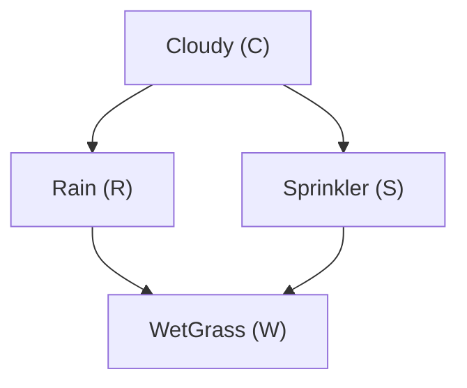

# Laboratory Report: Building and Learning a Bayesian Network

**Course:** Artificial Intelligence (CS F407)  
**Laboratory Exercise:** Building and Learning a Bayesian Network (`llm_bn.ipynb`)  
**Reference Document:** [`screencapture-github-tirtharajdash-CS-F407-AI-AY2026-27-S1-blob-main-notebooks-llm-bn-ipynb-2026-10-01-00_51_29.pdf`](file:///Users/vanshsharma/Documents/AI%20Labs/Lab_4_Bayesian_Networks/screencapture-github-tirtharajdash-CS-F407-AI-AY2026-27-S1-blob-main-notebooks-llm-bn-ipynb-2026-10-01-00_51_29.pdf)

---

## 1. Overview & Conceptual Grounding

### 1.1 AI Science vs. AI Engineering in Probabilistic Graphical Models
- **AI Science:** Formulating the probabilistic model, declaring explicit conditional independence assumptions, specifying Conditional Probability Distributions (CPDs), and mathematically defining exact posterior inference and parameter estimation principles.
- **AI Engineering:** Leveraging modern coding LLMs to rapidly translate natural-language and mathematical specifications into executable probabilistic programming code (e.g. using `pgmpy`), while establishing an engineering verification pipeline (`specification` $\to$ `generation` $\to$ `AST safety inspection` $\to$ `approval` $\to$ `execution` $\to$ `test oracle validation`).

---

## 2. Bayesian Network Specification & Factorisation

### 2.1 Graph Structure
The canonical Sprinkler network models dependencies among four binary random variables:
- $C$: Cloudy ($0 = \text{False}, 1 = \text{True}$)
- $R$: Rain ($0 = \text{False}, 1 = \text{True}$)
- $S$: Sprinkler ($0 = \text{False}, 1 = \text{True}$)
- $W$: WetGrass ($0 = \text{False}, 1 = \text{True}$)

**Directed Edges:**
$$C \to R, \quad C \to S, \quad R \to W, \quad S \to W$$

### 2.2 Joint Probability Factorisation
By the local Markov property of Directed Acyclic Graphs (DAGs), each variable is conditionally independent of its non-descendants given its parents:
$$P(C, R, S, W) = P(C) \, P(R \mid C) \, P(S \mid C) \, P(W \mid R, S)$$

### 2.3 Ground Truth Numerical Parameters
- **Prior on Cloudy:**
  $$P(C = 1) = 0.5, \quad P(C = 0) = 0.5$$
- **CPD for Rain given Cloudy:**
  $$P(R = 1 \mid C = 0) = 0.2, \quad P(R = 1 \mid C = 1) = 0.8$$
- **CPD for Sprinkler given Cloudy:**
  $$P(S = 1 \mid C = 0) = 0.5, \quad P(S = 1 \mid C = 1) = 0.1$$
- **CPD for WetGrass given Rain and Sprinkler:**
  $$P(W = 1 \mid R = 0, S = 0) = 0.01$$
  $$P(W = 1 \mid R = 0, S = 1) = 0.90$$
  $$P(W = 1 \mid R = 1, S = 0) = 0.90$$
  $$P(W = 1 \mid R = 1, S = 1) = 0.99$$

---

## 3. Exact Inference and Independent Test Oracle

### 3.1 Inference Task: $P(R = 1 \mid W = 1)$
We observe that the grass is wet ($W = 1$) and seek the posterior probability that it rained ($R = 1$).

### 3.2 Step-by-Step Variable Elimination
To compute $P(R, W = 1)$, we sum out the unobserved hidden variables $S$ and $C$:
$$P(R, W = 1) = \sum_{C} \sum_{S} P(C) \, P(R \mid C) \, P(S \mid C) \, P(W = 1 \mid R, S)$$

1. **Eliminate $S$:**
   $$\phi_1(C, R) = \sum_{S \in \{0, 1\}} P(S \mid C) \, P(W = 1 \mid R, S)$$
2. **Eliminate $C$:**
   $$\phi_2(R) = \sum_{C \in \{0, 1\}} P(C) \, P(R \mid C) \, \phi_1(C, R)$$
3. **Normalize over $R$:**
   $$P(R = 1 \mid W = 1) = \frac{\phi_2(R = 1)}{\phi_2(R = 0) + \phi_2(R = 1)}$$

### 3.3 Test Oracle (Exhaustive State Enumeration)
Because the network has $2^4 = 16$ discrete assignments, we independently evaluate all 16 terms to form a trusted verification oracle:
- **Numerator $\sum_{C, S} P(C, R = 1, S, W = 1)$:**
  - $C=0, R=1, S=0, W=1: 0.5 \times 0.2 \times 0.5 \times 0.90 = 0.0450$
  - $C=0, R=1, S=1, W=1: 0.5 \times 0.2 \times 0.5 \times 0.99 = 0.0495$
  - $C=1, R=1, S=0, W=1: 0.5 \times 0.8 \times 0.9 \times 0.90 = 0.3240$
  - $C=1, R=1, S=1, W=1: 0.5 \times 0.8 \times 0.1 \times 0.99 = 0.0396$
  - **Sum (Rain = 1 & WetGrass = 1):** $0.4581$
- **Denominator (WetGrass = 1):**
  - Rain = 0 terms sum to: $0.19204$
  - Total $P(W = 1) = 0.4581 + 0.19204 = 0.65014$
- **Exact Posterior:**
  $$P(\text{Rain} = 1 \mid \text{WetGrass} = 1) = \frac{0.4581}{0.65014} \approx \mathbf{0.7047692307692308}$$
- **Exact Posterior for Rain = 0:**
  $$P(\text{Rain} = 0 \mid \text{WetGrass} = 1) = \frac{0.19204}{0.65014} \approx \mathbf{0.2952307692307692}$$

**Numerical Precision Verification:**  
The difference between the independent enumeration test oracle and `pgmpy`'s `VariableElimination` is $< 10^{-16}$ (exact agreement to floating-point precision).

---

## 4. AST Code Safety Verification for LLM-Generated Code

### 4.1 Engineering Risk of LLM Code Generation
LLMs generating executable code can hallucinate deprecated APIs, introduce unsafe system calls (`os.system`, `subprocess`, `open`), or alter probability schemas. A robust pipeline enforces Abstract Syntax Tree (AST) validation prior to execution:
1. **Disallow Unsafe Modules:** Only allow specified libraries (`pgmpy`, `numpy`, `pandas`, `math`, `itertools`).
2. **Disallow Dynamic Evaluation:** Forbid `eval()`, `exec()`, `__import__()`.
3. **Explicit User Gate:** Require human inspection (`APPROVE_GENERATED_CODE = True`) before invoking execution.

---

## 5. Parameter Estimation & Sampling Variability

### 5.1 Maximum Likelihood Estimation (MLE) from Simulated Data
Using forward sampling, we generate $N = 100$ observations from the reference model across 5 distinct random seeds and estimate $\hat{P}(R = 1 \mid C = 1)$:

| Random Seed | Sample Size ($N$) | Ground Truth $P(R=1 \mid C=1)$ | Estimated $\hat{P}$ | Estimation Error |
|:---:|:---:|:---:|:---:|:---:|
| 1 | 100 | 0.8000 | 0.7885 | -0.0115 |
| 2 | 100 | 0.8000 | 0.8542 | +0.0542 |
| 3 | 100 | 0.8000 | 0.7917 | -0.0083 |
| 4 | 100 | 0.8000 | 0.7692 | -0.0308 |
| 5 | 100 | 0.8000 | 0.7400 | -0.0600 |
| **Mean** | 100 | **0.8000** | **0.7887** | **-0.0113** |

### 5.2 Scientific Interpretation of Variability
Variations across seeds are due to **finite-sample statistical variance** ($\mathcal{O}(1/\sqrt{N})$), not algorithmic bugs in MLE or defects in `pgmpy`. As $N \to \infty$, the MLE estimate converges asymptotically to the true parameter ($0.8000$) by the Law of Large Numbers.

---

## 6. Evaluation Rubric for LLM-Generated Bayesian Network Code

1. **Structure:**
   - Correct variables and state cardinalities.
   - Directed acyclic graph (DAG) topology matching causal specification without cycles.
2. **Parameters:**
   - Every CPD column sums strictly to 1.0.
   - Correct parent-state ordering in multi-parent CPTs.
3. **Inference:**
   - Correct variable elimination query specification.
   - Posterior values verified against an independent mathematical test oracle.
4. **Parameter Estimation:**
   - Fixed graph structure maintained; correct estimator applied (`DiscreteMLE` / `BayesianEstimator`).
5. **Software Safety:**
   - Source parsed and verified via AST before running in isolated sandbox.
