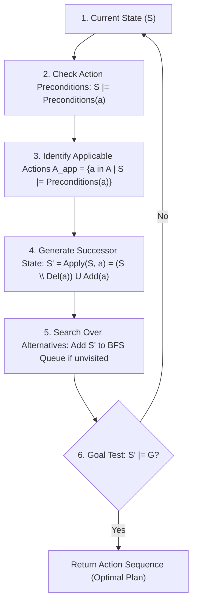

# Laboratory Report: Logical Planning

**Course:** Artificial Intelligence (CS F407)  
**Laboratory Exercise:** Logical Reasoning for Planning (`logic_lab_ex.pdf`)  
**Implementation Script:** [`logical_planner.py`](file:///Users/vanshsharma/Documents/AI%20Labs/Logical_Planning/logical_planner.py)  
**Prolog Knowledge Base:** [`planner.pl`](file:///Users/vanshsharma/Documents/AI%20Labs/Logical_Planning/planner.pl)  
**Interactive Notebook:** [`logical_planning_notebook.ipynb`](file:///Users/vanshsharma/Documents/AI%20Labs/Logical_Planning/logical_planning_notebook.ipynb)

---

## 1. Overview & Theoretical Foundations

### 1.1 The Central Formulation: Logic + Search = Planning
A classical automated planning problem is formally characterized by a triple:
$$\mathcal{P} = \langle \mathcal{I}, \mathcal{A}, \mathcal{G} \rangle$$
where:
- $\mathcal{I}$ is the **Initial State** (a finite set of ground logical atoms representing facts true in the world).
- $\mathcal{A}$ is the set of **Action Schemas** defining permissible operations.
- $\mathcal{G}$ is the **Goal Condition** (a set of ground logical atoms that must hold for success).

The fundamental division of responsibilities in planning is:
$$\mathbf{Logic \text{ (Action Applicability \& State Progression)}} + \mathbf{Search \text{ (Path Finding over State Graph)}} = \mathbf{Planning}$$

- **The Logical Engine:** Evaluates whether an action is physically and legally applicable in a given state by testing logical entailment ($S \models \text{Preconditions}(a)$) and computes the exact state progression $S' = \text{Apply}(S, a) = (S \setminus \text{Del}(a)) \cup \text{Add}(a)$.
- **The Search Engine:** Explores alternative sequences of validly generated successor states (e.g. via Breadth-First Search) to find an optimal sequence reaching $S^* \models \mathcal{G}$.

---

## 2. Task 0: Planning Problem Specification

### 2.1 Formal Description
We consider a warehouse environment with three linearly connected locations: $A \longleftrightarrow B \longleftrightarrow C$.

1. **Initial State ($\mathcal{I}$):**
   $$\mathcal{I} = \{\text{At}(\text{Robot}, A), \text{At}(\text{Package}, A)\}$$
2. **Goal State ($\mathcal{G}$):**
   $$\mathcal{G} = \{\text{At}(\text{Package}, C)\}$$
3. **Available Action Schemas ($\mathcal{A}$):**

| Action Schema | Positive Preconditions | Negative Preconditions | Positive Effects ($\text{Add}$) | Negative Effects ($\text{Del}$) |
| :--- | :--- | :--- | :--- | :--- |
| $\text{Move}(X, Y)$ | $\{\text{At}(\text{Robot}, X)\}$ | $\emptyset$ | $\{\text{At}(\text{Robot}, Y)\}$ | $\{\text{At}(\text{Robot}, X)\}$ |
| $\text{PickUp}(\text{Package}, X)$ | $\{\text{At}(\text{Robot}, X), \text{At}(\text{Package}, X)\}$ | $\{\text{Holding}(\text{Package})\}$ | $\{\text{Holding}(\text{Package})\}$ | $\{\text{At}(\text{Package}, X)\}$ |
| $\text{Drop}(\text{Package}, X)$ | $\{\text{At}(\text{Robot}, X), \text{Holding}(\text{Package})\}$ | $\emptyset$ | $\{\text{At}(\text{Package}, X)\}$ | $\{\text{Holding}(\text{Package})\}$ |

*Topological Connectivity:* $\text{Move}(X, Y)$ is defined only for adjacent pairs $(A, B), (B, A), (B, C), (C, B)$.

### 2.2 Task 0 Question: Action Applicability Analysis
> **Question:** Starting from $\mathcal{I} = \{\text{At}(\text{Robot}, A), \text{At}(\text{Package}, A)\}$, is $\text{PickUp}(\text{Package}, A)$ applicable? What about $\text{Drop}(\text{Package}, C)$?

**Analysis:**
1. **$\text{PickUp}(\text{Package}, A)$:**
   - Preconditions: $\text{Pre}^+(\text{PickUp}(P, A)) = \{\text{At}(\text{Robot}, A), \text{At}(\text{Package}, A)\}$, $\text{Pre}^- = \{\text{Holding}(\text{Package})\}$.
   - State Evaluation: Both required facts $\text{At}(\text{Robot}, A) \in \mathcal{I}$ and $\text{At}(\text{Package}, A) \in \mathcal{I}$ are present, and $\text{Holding}(\text{Package}) \notin \mathcal{I}$.
   - **Conclusion:** $\mathcal{I} \models \text{Preconditions}(\text{PickUp}(P, A))$. The action is **APPLICABLE**.
2. **$\text{Drop}(\text{Package}, C)$:**
   - Preconditions: $\text{Pre}^+(\text{Drop}(P, C)) = \{\text{At}(\text{Robot}, C), \text{Holding}(\text{Package})\}$.
   - State Evaluation: Neither $\text{At}(\text{Robot}, C)$ nor $\text{Holding}(\text{Package})$ is in $\mathcal{I}$.
   - **Conclusion:** $\mathcal{I} \not\models \text{Preconditions}(\text{Drop}(P, C))$. The action is **INAPPLICABLE**. Attempting to execute it would violate physical reality (dropping an object that is not held, at a location where the robot is not present).

---

## 3. Task 1: Manual Plan Construction

A valid plan is a finite sequence of actions $\langle a_1, a_2, \dots, a_n \rangle$ such that $a_1$ is applicable in $\mathcal{I}$, $a_{i}$ is applicable in $S_{i-1}$, and $S_n \models \mathcal{G}$.

| Step ($t$) | Action Executed ($a_t$) | Resulting State ($S_t$) | Preconditions Checked |
| :---: | :--- | :--- | :--- |
| **0** | *(Initial)* | $S_0 = \{\text{At}(\text{Robot}, A), \text{At}(\text{Package}, A)\}$ | N/A |
| **1** | $\text{PickUp}(\text{Package}, A)$ | $S_1 = \{\text{At}(\text{Robot}, A), \text{Holding}(\text{Package})\}$ | $\text{At}(\text{Robot}, A) \in S_0 \land \text{At}(\text{Package}, A) \in S_0$ |
| **2** | $\text{Move}(A, B)$ | $S_2 = \{\text{At}(\text{Robot}, B), \text{Holding}(\text{Package})\}$ | $\text{At}(\text{Robot}, A) \in S_1 \land \text{Connected}(A, B)$ |
| **3** | $\text{Move}(B, C)$ | $S_3 = \{\text{At}(\text{Robot}, C), \text{Holding}(\text{Package})\}$ | $\text{At}(\text{Robot}, B) \in S_2 \land \text{Connected}(B, C)$ |
| **4** | $\text{Drop}(\text{Package}, C)$ | $S_4 = \{\text{At}(\text{Robot}, C), \text{At}(\text{Package}, C)\}$ | $\text{At}(\text{Robot}, C) \in S_3 \land \text{Holding}(\text{Package}) \in S_3$ |

**Goal Verification:** $\mathcal{G} = \{\text{At}(\text{Package}, C)\} \subseteq S_4$. The plan $\pi = \langle \text{PickUp}(P, A), \text{Move}(A, B), \text{Move}(B, C), \text{Drop}(P, C) \rangle$ is sound, valid, and minimal (length 4).

---

## 4. Task 2 & 3: Python Planner Implementation & Testing

### 4.1 Implementation Architecture
In [`logical_planner.py`](file:///Users/vanshsharma/Documents/AI%20Labs/Logical_Planning/logical_planner.py), we implement:
- `Action`: Encapsulates preconditions and effects, implementing `is_applicable(state)` via set operations and `apply(state)` via $(S \setminus \text{Del}) \cup \text{Add}$.
- `PlanningProblem`: Implements a Breadth-First Search queue exploring the state graph. Visited states are stored as canonical `frozenset` objects to prune cycles.

### 4.2 Systematic Empirical Test Suite

```
======================================================================
TEST A: SOLVABLE PROBLEM (Original Warehouse Delivery A -> C)
======================================================================
Initial State : ['At(Package, A)', 'At(Robot, A)']
Goal State    : ['At(Package, C)']
Plan Found?   : True
Plan Length   : 4 steps
Nodes Explored: 6

Plan Execution Sequence:
  Step 01: PickUp(Package, A)
  Step 02: Move(A, B)
  Step 03: Move(B, C)
  Step 04: Drop(Package, C)

Step-by-Step State Progression:
  S_0: ['At(Package, A)', 'At(Robot, A)']
  S_1: ['At(Robot, A)', 'Holding(Package)']
  S_2: ['At(Robot, B)', 'Holding(Package)']
  S_3: ['At(Robot, C)', 'Holding(Package)']
  S_4: ['At(Package, C)', 'At(Robot, C)']

[PASS] Test A Plan Validity Oracle: Every action precondition was strictly satisfied.

----------------------------------------------------------------------
TEST B: IMPOSSIBLE PROBLEM (Package Cannot Be Picked Up)
----------------------------------------------------------------------
Initial State : ['At(Package, A)', 'At(Robot, A)']
Goal State    : ['At(Package, C)']
Plan Found?   : False
Output Report : No plan found
[PASS] Test B Oracle: Planner correctly detected unreachable goal and halted without inventing actions.

----------------------------------------------------------------------
TEST C: IRRELEVANT ACTIONS (Robot Movements Without Package)
----------------------------------------------------------------------
Initial State : ['At(Package, A)', 'At(Robot, A)']
Goal State    : ['At(Package, C)']
Plan Found?   : True
Final State   : ['At(Package, C)', 'At(Robot, C)']
[PASS] Test C Oracle: Planner correctly verified At(Package, C), not merely At(Robot, C).
```

### 4.3 Summary of Test Results
| Test ID | Scenario | Expected Outcome | Observed Outcome | Correctness Oracle |
| :--- | :--- | :--- | :--- | :---: |
| **Test A** | Original Solvable Warehouse | 4-step plan: $\text{PickUp} \to \text{Move} \to \text{Move} \to \text{Drop}$ | Found 4-step plan; explored 6 states | **PASS** |
| **Test B** | Impossible Problem (No $\text{PickUp}$) | Terminate and report "No plan found" | Returned `False` without fabricating steps | **PASS** |
| **Test C** | Irrelevant Actions Present | Find valid plan without getting distracted by spurious robot moves | Found optimal 4-step plan reaching true goal | **PASS** |

---

## 5. Task 4: The Synergy of Logic and Search

### 5.1 The Planning Loop Workflow
The complete planning loop integrates logic and search:



### 5.2 Philosophical Breakdown: "Logic Determines What Is Possible; Search Determines What to Try"
1. **Logic as the Constraint Engine:** Propositional logic acts as the laws of physics for the virtual agent. It restricts state transitions to only physically plausible transformations. It guarantees that an agent cannot pick up a box remotely or drop a package it is not holding.
2. **Search as the Optimization Engine:** Given all logically legal transitions, search explores the combinatorial branching tree to find a sequence of actions leading from $\mathcal{I}$ to $\mathcal{G}$ while avoiding redundant cycles and dead ends.

---

## 6. Task 5: LLM Verification vs. Independent Execution

> **Question:** Which should you trust more: (a) the LLM's natural-language explanation of why a plan is valid, or (b) the independently executed state transitions computed by your Python program? Explain why.

**Response:**
We must **unconditionally trust (b) the independently executed state transitions**.
- **Reasoning:** Large Language Models are statistical next-token prediction systems. When asked to "explain" why a plan is valid, the LLM generates plausible-sounding text that mimics sound reasoning, but it does not execute formal proof checks or state simulations. LLMs routinely hallucinate preconditions being satisfied when they are not.
- **The Golden Rule of AI Engineering:** A text generation explaining validity is not a formal verification. Independent code execution operates as an absolute test oracle: it computes set intersections and differences deterministically, adhering strictly to mathematical definitions.

---

## 7. Section 5: Answers to Reflection Questions

### Question 1: Value of Specifying Preconditions and Effects Early
> *Why is it useful to specify action preconditions and effects before asking an LLM to write the planner?*

Specifying preconditions and effects decouples the **problem specification** from the **algorithm implementation**. If the specification is ambiguous, the LLM will hallucinate ad-hoc assumptions (e.g. assuming the robot can hold multiple packages or teleport). Providing a formal specification forces the generated code to implement exact set-based predicate checking.

### Question 2: Consequences of Omitting Precondition Checks
> *Give an example of an error that could occur if the planner failed to check an action's preconditions.*

If preconditions are ignored, the planner could execute $\text{Drop}(\text{Package}, C)$ directly in initial state $S_0 = \{\text{At}(\text{Robot}, A), \text{At}(\text{Package}, A)\}$. The state progression would immediately assert $\text{At}(\text{Package}, C)$, falsely declaring the problem solved in 1 step while the robot and package never physically left location $A$.

### Question 3: "Looks Reasonable" vs. Logically Valid Plans
> *Why is a plan that "looks reasonable" not necessarily a valid plan?*

A plan like $\langle \text{Move}(A, B), \text{Move}(B, C), \text{Drop}(P, C) \rangle$ superficially looks like a standard delivery trajectory. However, it fails to execute $\text{PickUp}(P, A)$. To casual inspection, the movements match the route, but logically the robot arrives at $C$ empty-handed.

### Question 4: LLM Contributions to Implementation
> *What did the LLM contribute to the implementation?*

The LLM rapidly generated boilerplate Python code (class scaffolding, `deque` handling, set difference/union expressions, and test cases), accelerating development time from hours to minutes.

### Question 5: What Had to Be Verified Independently?
> *What did you have to verify independently?*

We had to verify:
1. Whether `is_applicable` checks both positive and negative preconditions.
2. Whether `apply` strips deleted predicates before adding new ones.
3. Whether the BFS queue properly prevents cycles via state hashing (`frozenset`).
4. Whether the goal test checks set subset inclusion ($\mathcal{G} \subseteq S$).

### Question 6: Where Logical Reasoning Is Used
> *In this laboratory, where is logical reasoning being used?*

1. **Entailment Verification:** Checking $S \models \text{Preconditions}(a)$ and $S \models \mathcal{G}$.
2. **State Progression Calculus:** Applying monotonic add-lists and non-monotonic delete-lists to mutate ground literal sets.
3. **Prolog Deductive Inference:** Resolving rules via Horn-clause backward chaining.

### Question 7: Relationship to Previous Search Modules
> *How is planning related to the search algorithms studied in the previous module?*

In standard search (e.g. $A^*$ on a grid), nodes are atomic grid coordinates $(x, y)$, and successors are adjacent coordinates. In **logical planning**, nodes are entire propositional states (sets of predicates), and graph edges are dynamically generated by evaluating logical action applicability. Planning is state-space search over a declarative logical model.

---

## 8. Section 7: Prolog as a Logical Plan Verifier

### 8.1 Knowledge Base ([`planner.pl`](file:///Users/vanshsharma/Documents/AI%20Labs/Logical_Planning/planner.pl))
```prolog
% Warehouse Topology (Facts)
connected(a, b).
connected(b, a).
connected(b, c).
connected(c, b).

% Rules
can_move(X, Y) :- connected(X, Y).
valid_move(X, Y) :- connected(X, Y).

% Logical Implication Chain
wet_road.
slippery :- wet_road.
reduce_speed :- slippery.
```

### 8.2 Task 6 & 7 Questions and Challenge
> **(a) Why does Prolog return `true` for `can_move(a, b)`?**  
Because `can_move(a, b)` unifies with the rule `can_move(X, Y) :- connected(X, Y)` with substitution $\theta = \{X/a, Y/b\}$, and `connected(a, b)` is an established ground fact in the knowledge base.

> **(b) Why does it not establish `can_move(a, c)`?**  
Under the Closed World Assumption (CWA), Prolog attempts to prove `connected(a, c)`. No such fact exists, and no rule can deduce it. Hence, the query fails (returns `false`).

> **(c) Relationship between Prolog rule and logical implication:**  
The Prolog rule `can_move(X, Y) :- connected(X, Y)` represents the first-order logical horn clause:
$$\forall X, Y \; (\text{Connected}(X, Y) \implies \text{CanMove}(X, Y))$$

> **Challenge:** Querying `?- valid_move(a, c).` fails immediately, proving that an LLM proposing a direct jump $\text{Move}(A, C)$ is rejected by formal deductive verification.

### 8.3 Task 8: Logical Implication Chain
$$\text{wet\_road} \implies \text{slippery} \implies \text{reduce\_speed}$$
- Modus Ponens step 1: $\text{wet\_road} \land (\text{wet\_road} \implies \text{slippery}) \vdash \text{slippery}$
- Modus Ponens step 2: $\text{slippery} \land (\text{slippery} \implies \text{reduce\_speed}) \vdash \text{reduce\_speed}$

### 8.4 Section 7.2 Reflection Questions
1. **Fact vs. Rule:** A fact is an unconditional atomic proposition asserted as true (`connected(a, b)`). A rule is a conditional Horn clause asserting that a head proposition is true provided all body subgoals are satisfied.
2. **Query Correspondence:** A Prolog query `?- Q` corresponds to testing whether the knowledge base logically entails the proposition ($\text{KB} \models Q$).
3. **Why Verify with Prolog:** Decouples the plan generator (Python/heuristic search) from the plan validator (declarative logic), preventing bugs in the planner from passing undetected.
4. **Advantage with LLM-Generated Outputs:** Provides a formally verified barrier: the LLM or Python agent can generate candidate plans heuristically, while an independent formal system guarantees zero physical constraint violations before deployment in the real world.
